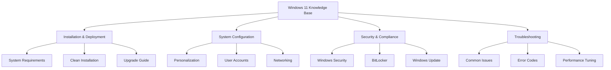
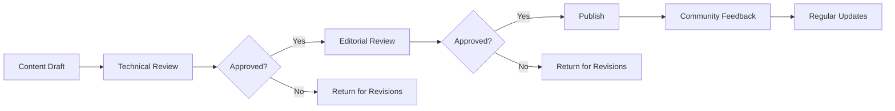

# About Windows 11 Knowledge Base

```yaml
mission: "To provide accurate, up-to-date, and accessible Windows 11 documentation for users of all skill levels."
scope: "Covering Windows 11 installation, configuration, security, troubleshooting, and advanced administration."
```

## Our Mission

Welcome to the Windows 11 Knowledge Base, a comprehensive resource designed to help users, administrators, and developers get the most out of Windows 11. Our goal is to provide clear, accurate, and actionable information that empowers our community to solve problems and master Windows 11 features.

<div class="principles-grid">
  <div class="principle-card">
    <div class="principle-icon">
      <svg viewBox="0 0 24 24" fill="currentColor">
        <path d="M12 2C6.48 2 2 6.48 2 12s4.48 10 10 10 10-4.48 10-10S17.52 2 12 2zm-2 15l-5-5 1.41-1.41L10 14.17l7.59-7.59L19 8l-9 9z"/>
      </svg>
    </div>
    <h3>Accuracy</h3>
    <p>Every article is thoroughly researched and verified by our team of Windows experts to ensure the information is current and reliable.</p>
  </div>
  
  <div class="principle-card">
    <div class="principle-icon">
      <svg viewBox="0 0 24 24" fill="currentColor">
        <path d="M3 17.25V21h3.75L17.81 9.94l-3.75-3.75L3 17.25zM20.71 7.04c.39-.39.39-1.02 0-1.41l-2.34-2.34c-.39-.39-1.02-.39-1.41 0l-1.83 1.83 3.75 3.75 1.83-1.83z"/>
      </svg>
    </div>
    <h3>Clarity</h3>
    <p>We break down complex topics into easy-to-understand guides with step-by-step instructions and clear examples.</p>
  </div>
  
  <div class="principle-card">
    <div class="principle-icon">
      <svg viewBox="0 0 24 24" fill="currentColor">
        <path d="M16 11c1.66 0 2.99-1.34 2.99-3S17.66 5 16 5c-1.66 0-3 1.34-3 3s1.34 3 3 3zm-8 0c1.66 0 2.99-1.34 2.99-3S9.66 5 8 5C6.34 5 5 6.34 5 8s1.34 3 3 3zm0 2c-2.33 0-7 1.17-7 3.5V19h14v-2.5c0-2.33-4.67-3.5-7-3.5zm8 0c-.29 0-.62.02-.97.05 1.16.84 1.97 1.97 1.97 3.45V19h6v-2.5c0-2.33-4.67-3.5-7-3.5z"/>
      </svg>
    </div>
    <h3>Community-Driven</h3>
    <p>Our content is shaped by real user feedback and contributions from the Windows community worldwide.</p>
  </div>
</div>

## Content Organization

Our knowledge base is structured to help you find information quickly and intuitively:



## Content Review Process

We maintain high standards through a rigorous review process:

<div class="timeline">
  <div class="timeline-item">
    <div class="timeline-dot">1</div>
    <div class="timeline-content">
      <h4>Content Creation</h4>
      <p>Subject matter experts draft content based on Microsoft documentation and real-world experience.</p>
    </div>
  </div>
  
  <div class="timeline-item">
    <div class="timeline-dot">2</div>
    <div class="timeline-content">
      <h4>Technical Review</h4>
      <p>Technical reviewers verify accuracy and completeness of the information.</p>
    </div>
  </div>
  
  <div class="timeline-item">
    <div class="timeline-dot">3</div>
    <div class="timeline-content">
      <h4>Editorial Review</h4>
      <p>Editors ensure clarity, consistency, and adherence to style guidelines.</p>
    </div>
  </div>
  
  <div class="timeline-item">
    <div class="timeline-dot">4</div>
    <div class="timeline-content">
      <h4>Community Feedback</h4>
      <p>Content is published and open to community feedback and updates.</p>
    </div>
  </div>
  
  <div class="timeline-item">
    <div class="timeline-dot">5</div>
    <div class="timeline-content">
      <h4>Scheduled Updates</h4>
      <p>Content is regularly reviewed and updated to reflect the latest Windows 11 changes.</p>
    </div>
  </div>
</div>

## Our Team

We're proud to be supported by a diverse group of Windows enthusiasts and experts:

<div class="contributors-grid">
  <div class="contributor">
    <div class="contributor-avatar">
      <span>JD</span>
    </div>
    <h4>Jane Doe</h4>
    <p>Windows MVP</p>
    <div class="contributor-links">
      <a href="#" aria-label="GitHub profile">
        <svg viewBox="0 0 24 24" fill="currentColor"><path d="M12 .3a12 12 0 0 0-3.8 23.4c.6.1.8-.3.8-.6v-2.2c-3.3.7-4-1.6-4-1.6-.5-1.4-1.2-1.8-1.2-1.8-1-.7.1-.7.1-.7 1.1.1 1.7 1.1 1.7 1.1.9 1.5 2.3 1.1 2.9.9.1-.7.4-1.1.8-1.4-2.9-.3-6-1.5-6-6.6 0-1.4.5-2.6 1.3-3.5-.1-.3-.6-1.6.1-3.3 0 0 1.1-.3 3.6 1.3a12.3 12.3 0 0 1 3.3-.4c1.1 0 2.2.1 3.3.4 2.5-1.6 3.6-1.3 3.6-1.3.7 1.7.2 3 .1 3.3.8.9 1.3 2.1 1.3 3.5 0 5.1-3.1 6.3-6.1 6.6.5.4.9 1.2.9 2.4v3.5c0 .3.2.7.8.6A12 12 0 0 0 12 .3z"/></svg>
      </a>
    </div>
  </div>
  
  <div class="contributor">
    <div class="contributor-avatar">
      <span>AS</span>
    </div>
    <h4>Alex Smith</h4>
    <p>Enterprise Admin</p>
    <div class="contributor-links">
      <a href="#" aria-label="Twitter profile">
        <svg viewBox="0 0 24 24" fill="currentColor"><path d="M22.46 6c-.77.35-1.6.58-2.46.69.88-.53 1.56-1.37 1.88-2.38-.83.5-1.75.85-2.72 1.05C18.37 4.5 17.26 4 16 4c-2.35 0-4.27 1.92-4.27 4.29 0 .34.04.67.11.98C8.28 9.09 5.11 7.38 3 4.79c-.37.63-.58 1.37-.58 2.15 0 1.49.75 2.81 1.91 3.56-.71 0-1.37-.2-1.95-.5v.03c0 2.08 1.48 3.82 3.44 4.21a4.22 4.22 0 0 1-1.93.07 4.28 4.28 0 0 0 4 2.98 8.521 8.521 0 0 1-5.33 1.84c-.34 0-.68-.02-1.02-.06C3.44 20.29 5.7 21 8.12 21 16 21 20.33 14.46 20.33 8.79c0-.19 0-.37-.01-.56.84-.6 1.56-1.36 2.14-2.23z"/></svg>
      </a>
    </div>
  </div>
  
  <div class="contributor">
    <div class="contributor-avatar">
      <span>MJ</span>
    </div>
    <h4>Maria Garcia</h4>
    <p>Security Expert</p>
    <div class="contributor-links">
      <a href="#" aria-label="LinkedIn profile">
        <svg viewBox="0 0 24 24" fill="currentColor"><path d="M20.45 20.45h-3.56v-5.57c0-1.33-.02-3.04-1.85-3.04-1.85 0-2.14 1.45-2.14 2.94v5.67H9.38V9.1h3.42v1.57h.05c.48-.9 1.63-1.85 3.35-1.85 3.58 0 4.24 2.36 4.24 5.43v6.2zM5.7 7.56c-1.14 0-2.06-.93-2.06-2.07 0-1.14.92-2.06 2.06-2.06 1.14 0 2.06.92 2.06 2.06 0 1.15-.92 2.07-2.06 2.07zM7.13 20.45H4.27V9.1h2.86v11.36zM22.22 0H1.8C.81 0 0 .81 0 1.8v20.4c0 .99.81 1.8 1.8 1.8h20.4c.99 0 1.8-.81 1.8-1.8V1.8C24 .81 23.19 0 22.2 0h.02z"/></svg>
      </a>
    </div>
  </div>
  
  <div class="contributor">
    <div class="contributor-avatar">
      <span>+12</span>
    </div>
    <h4>Community Contributors</h4>
    <p>And many more helping hands</p>
    <div class="contributor-links">
      <a href="#" class="button button--small">Join Us</a>
    </div>
  </div>
</div>

## Verification Workflow

All content goes through a strict verification process before publication:



## Get Involved

We welcome contributions from the community. Whether you're a Windows expert or just getting started, there are many ways to help:

- Report issues or suggest improvements
- Contribute new content or translations
- Help with documentation review
- Share your expertise in the forums

Ready to contribute? Check out our [Contribution Guidelines](/CONTRIBUTING.md) to get started.

## License

This documentation is licensed under the [Creative Commons Attribution 4.0 International License](https://creativecommons.org/licenses/by/4.0/).

## Contact

Have questions or feedback? [Contact our team](mailto:docs@example.com) or join our community forums.
