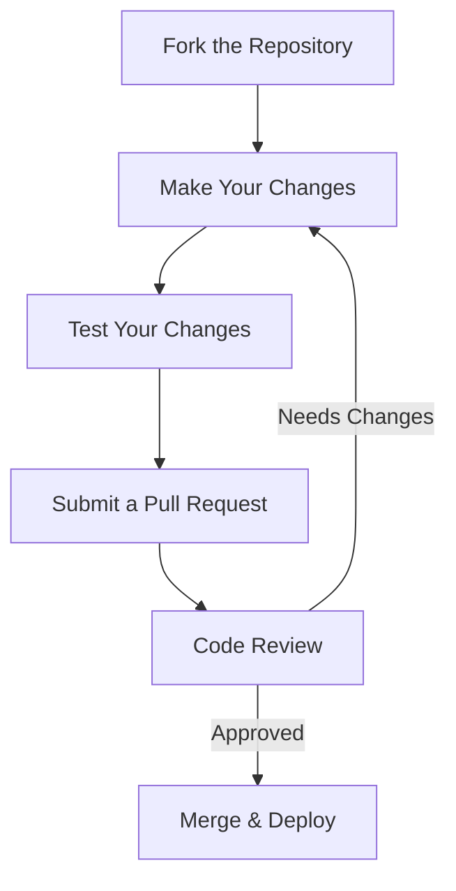

# How to Contribute

We welcome contributions from everyone! Whether you're fixing a typo, adding new content, or suggesting improvements, your help makes this knowledge base better for everyone.

## Contribution Process



## Quick Start Guide

1. **Fork** the repository on GitHub
2. **Clone** your fork locally
3. Create a new **branch** for your changes
4. Make your changes following our style guide
5. **Test** your changes locally
6. **Commit** and **push** to your fork
7. Open a **Pull Request** with a clear description

## Contribution Form

<div class="contribution-form">
  <div class="form-group">
    <label for="contribution-type">Type of Contribution</label>
    <select id="contribution-type" class="form-control" required>
      <option value="" disabled selected>Select contribution type</option>
      <option value="typo">Typo/Grammar Fix</option>
      <option value="update">Content Update</option>
      <option value="new">New Article</option>
      <option value="translation">Translation</option>
      <option value="bug">Bug Report</option>
    </select>
  </div>
  
  <div class="form-group">
    <label for="article-title">Article Title</label>
    <input type="text" id="article-title" class="form-control" placeholder="e.g., How to Update Windows 11" required>
  </div>
  
  <div class="form-group">
    <label for="article-url">Article URL (if applicable)</label>
    <input type="url" id="article-url" class="form-control" placeholder="https://...">
  </div>
  
  <div class="form-group">
    <label for="difficulty">Difficulty Level</label>
    <div class="difficulty-levels">
      <label class="difficulty-label beginner">
        <input type="radio" name="difficulty" value="beginner" required>
        <span>Beginner</span>
      </label>
      <label class="difficulty-label intermediate">
        <input type="radio" name="difficulty" value="intermediate">
        <span>Intermediate</span>
      </label>
      <label class="difficulty-label advanced">
        <input type="radio" name="difficulty" value="advanced">
        <span>Advanced</span>
      </label>
    </div>
  </div>
  
  <div class="form-group">
    <label for="description">Description of Changes</label>
    <textarea id="description" class="form-control" rows="4" required placeholder="Please describe your changes in detail..."></textarea>
  </div>
  
  <div class="form-group">
    <label for="preview">Preview Your Changes</label>
    <div id="preview" class="preview-area">
      <!-- Preview will be rendered here -->
      <p class="preview-placeholder">Your formatted content will appear here...</p>
    </div>
  </div>
  
  <div class="form-actions">
    <button type="submit" class="button button--primary">Submit Contribution</button>
    <button type="button" class="button button--secondary">Save Draft</button>
  </div>
</div>

## Style Guide

### Writing Standards

- Use clear, concise language
- Write in second person ("you") for user instructions
- Use active voice
- Keep paragraphs short (3-4 sentences max)
- Use headings to organize content logically

### Code Formatting

Use fenced code blocks with language specification:

```bash
# Command line example
winget install Microsoft.PowerShell
```

```powershell
# PowerShell example
Get-WindowsUpdate -Install -AcceptAll -AutoReboot
```

### Markdown Examples

```markdown
# Main Heading (H1)

## Section (H2)

### Subsection (H3)

**Bold text** for important information

*Italic text* for emphasis

> Blockquotes for notes and warnings

- Bulleted lists
- For related items

1. Numbered lists
2. For sequential steps

[Link text](https://example.com)


| Table Header 1 | Table Header 2 |
|----------------|----------------|
| Row 1 Col 1    | Row 1 Col 2    |
| Row 2 Col 1    | Row 2 Col 2    |
```

## Article Template

<div class="template-card">
  <div class="template-header">
    <h3>Article Template</h3>
    <a href="/templates/article-template.md" download class="button button--primary">
      <svg viewBox="0 0 24 24" width="16" height="16" style="margin-right: 8px;">
        <path fill="currentColor" d="M19 9h-4V3H9v6H5l7 7 7-7zM5 18v2h14v-2H5z"/>
      </svg>
      Download Template
    </a>
  </div>
  <div class="template-content">
    <p>Use this template when creating new articles to maintain consistency across the knowledge base.</p>
    <pre><code># Article Title

```yaml
summary: "Brief description of the article"
prerequisites: []
difficulty: beginner|intermediate|advanced
last_updated: YYYY-MM-DD
author: "Your Name"
```

## Overview

[Brief introduction to the topic]

## Prerequisites

- [ ] Prerequisite 1
- [ ] Prerequisite 2

## Step-by-Step Guide

### Step 1: [Step Title]

[Detailed instructions]

```powershell
# Example code if applicable
```

### Step 2: [Step Title]

[Detailed instructions]

## Troubleshooting

| Issue | Solution |
|-------|----------|
| Common issue 1 | Solution 1 |
| Common issue 2 | Solution 2 |

## Related Articles

- [Related Article 1](#)
- [Related Article 2](#)

## References

- [Microsoft Documentation](#)
- [External Resource](#)</code></pre>
  </div>
</div>

## Contribution Checklist

<div class="checklist">
  <div class="checklist-item" data-completed="false">
    <input type="checkbox" id="check1" class="checklist-checkbox">
    <label for="check1" class="checklist-label">I've searched for existing issues/PRs</label>
  </div>
  
  <div class="checklist-item" data-completed="false">
    <input type="checkbox" id="check2" class="checklist-checkbox">
    <label for="check2" class="checklist-label">I've followed the style guide</label>
  </div>
  
  <div class="checklist-item" data-completed="false">
    <input type="checkbox" id="check3" class="checklist-checkbox">
    <label for="check3" class="checklist-label">I've tested my changes</label>
  </div>
  
  <div class="checklist-item" data-completed="false">
    <input type="checkbox" id="check4" class="checklist-checkbox">
    <label for="check4" class="checklist-label">I've updated documentation if needed</label>
  </div>
  
  <div class="checklist-item" data-completed="false">
    <input type="checkbox" id="check5" class="checklist-checkbox">
    <label for="check5" class="checklist-label">I've added/updated tests if applicable</label>
  </div>
</div>

## Difficulty Levels

<div class="difficulty-levels-info">
  <div class="difficulty-info beginner">
    <h4>Beginner</h4>
    <p>Good first contributions for new contributors. Examples:</p>
    <ul>
      <li>Fixing typos and grammar</li>
      <li>Updating outdated information</li>
      <li>Improving formatting</li>
    </ul>
  </div>
  
  <div class="difficulty-info intermediate">
    <h4>Intermediate</h4>
    <p>For contributors with some experience. Examples:</p>
    <ul>
      <li>Adding new sections to existing articles</li>
      <li>Creating simple how-to guides</li>
      <li>Improving code examples</li>
    </ul>
  </div>
  
  <div class="difficulty-info advanced">
    <h4>Advanced</h4>
    <p>For experienced contributors. Examples:</p>
    <ul>
      <li>Writing comprehensive guides</li>
      <li>Creating troubleshooting workflows</li>
      <li>Implementing new features</li>
    </ul>
  </div>
</div>

## Getting Help

If you need help or have questions:

1. Check our [FAQ](#)
2. Join our [community forum](#)
3. Open an [issue](#) for technical questions
4. Reach out on [Discord/Slack](#)

We appreciate your contribution to making this knowledge base better for everyone!
